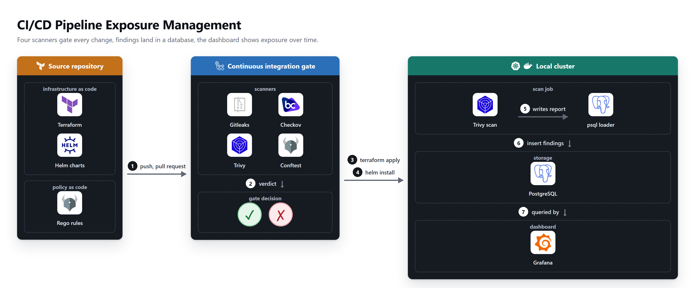
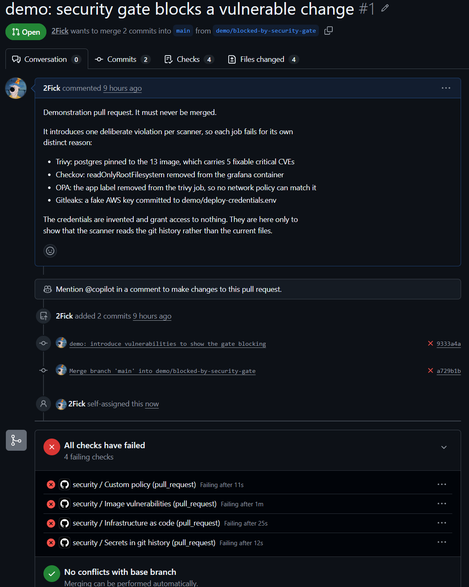
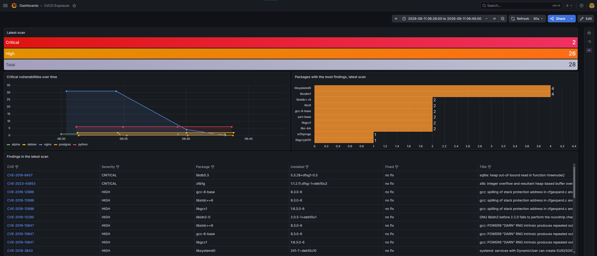

<p align="center">
  
</p>

<h1 align="center">CI/CD Pipeline Exposure Management</h1>

<p align="center">
  Four scanners gate every change, findings land in Postgres, Grafana shows exposure over time.
</p>

<p align="center">
  
  
  
  
  
  
  <br>
  
  
  
  
  
</p>

---

Container images, Kubernetes manifests, Terraform and git history are scanned on
every push and every pull request. A critical finding fails the build. Everything
that is found is written to a database, so the dashboard shows whether exposure is
going up or down instead of only what is wrong today.

The cluster is real. Terraform provisions it, hand written Helm charts deploy onto
it, and the scan jobs run inside it. Nothing runs in the cloud and nothing costs
anything.

## Architecture

<picture>
  <source media="(prefers-color-scheme: dark)" srcset="docs/architecture-dark.png">
  
</picture>

## The gate

A build stops when a scanner finds something that matters. [Pull request #1](../../pull/1)
exists to prove it: one deliberate violation per scanner, four failing checks, four
different reasons.



That pull request is never merged. Gitleaks reads the whole history, so merging it
would leave the fake key in `main` forever.

## The dashboard



The falling line is nginx. It sat at 31 critical vulnerabilities on `1.14.2`, dropped
to 4 when the version was updated to `1.31`, and reached 0 when the base image was
switched to Alpine. Two steps, two separate decisions, both measured rather than
assumed.

## The four scanners

Each one answers a question the others cannot. That was the rule when picking them.

| Tool | Looks for | Why it earns its place |
| --- | --- | --- |
| Trivy | Known CVEs in the images the charts deploy | Restricted to `--scanners vuln`, since secrets and misconfiguration belong to the tools below |
| Checkov | Misconfiguration in Terraform, Helm and Kubernetes | One policy engine across the whole stack instead of three linters |
| Gitleaks | Secrets in the full git history | A secret committed then deleted is gone from the files but still leaked |
| OPA and Conftest | Rules written for this project | The network policies select pods by an `app` label, so a workload missing one is silently unprotected. No vendor ships that rule |

Grype was left out on purpose. It does the same job as Trivy, and two CVE scanners
means reconciling two sets of results with no principled way to settle a
disagreement.

The gate blocks on critical findings that have a fix available. A vulnerability with
no patch cannot be acted on, and a gate that can never pass is a gate the team turns
off. Three Checkov rules are skipped, each with its reason written down in
[`.checkov.yaml`](.checkov.yaml), while the other 348 still block.

## Running it

Docker, Terraform, kubectl and Helm need to be installed.

Create the cluster:

```bash
cd terraform && terraform init && terraform apply
```

Deploy the components:

```bash
helm install postgres ./helm/postgres --namespace exposure --create-namespace
helm install grafana ./helm/grafana --namespace exposure
helm install trivy ./helm/trivy --namespace exposure
```

Each `helm upgrade trivy ./helm/trivy -n exposure` runs a fresh scan of every image
listed in `helm/trivy/values.yaml` and loads the results.

Open the dashboard:

```bash
kubectl port-forward -n exposure svc/grafana 3000:3000
```

It is at http://localhost:3000, user `admin`, and the password is generated on first
install:

```bash
kubectl get secret grafana-admin -n exposure -o jsonpath="{.data.ADMIN_PASSWORD}" | base64 -d
```

## Layout

```
terraform/            provisions the kind cluster
helm/postgres/        database, schema migration job, network policy
helm/trivy/           one scan job per target image, plus the loader that fills the database
helm/grafana/         dashboard and datasource, both provisioned from files
policy/               custom Rego rules
.github/workflows/    the four scanners and the gate
docs/diagram/         the architecture diagram is generated, not drawn
```

## Notes

Every container runs as a non root user with a read only filesystem, no Linux
capabilities and a seccomp profile. Network policies restrict which pods may reach
the database. Checkov reports zero failures on this repository, which took getting
from 74 down to zero rather than turning the rules off.

The network policies are written correctly but the default CNI in kind does not
enforce them, so on a local cluster they are declarative only. On a cluster running
Calico or Cilium they apply.
